# Enhanced Sequence Predictor with Mixture of Experts (MoE)

---

## High-Level System Architecture

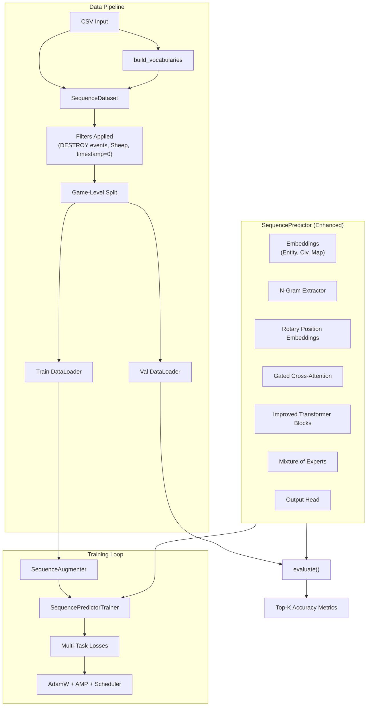

---

## Model Architecture: SequencePredictor

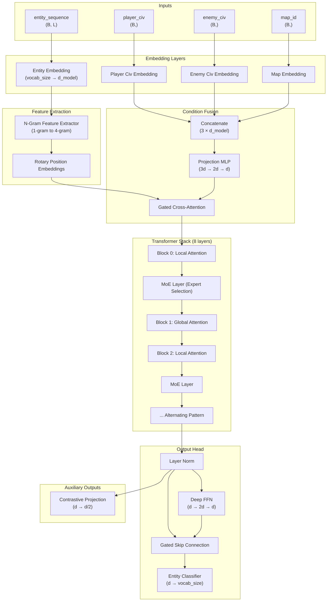

---

## Key Components

### 1. Rotary Position Embeddings (RoPE)

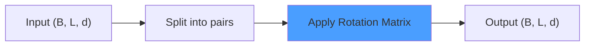

RoPE encodes relative positions through rotation matrices, enabling:
- Better generalization to longer sequences
- Position-aware attention without additive embeddings
- Efficient computation via precomputed cos/sin caches

### 2. Gated Cross-Attention

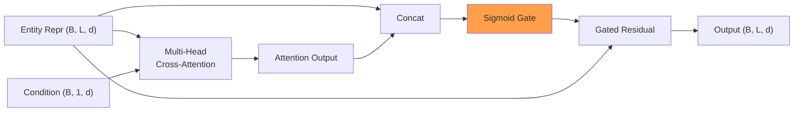

The gate learns to control how much condition information (player civ, enemy civ, map) flows into the entity representations.

### 3. N-Gram Feature Extractor

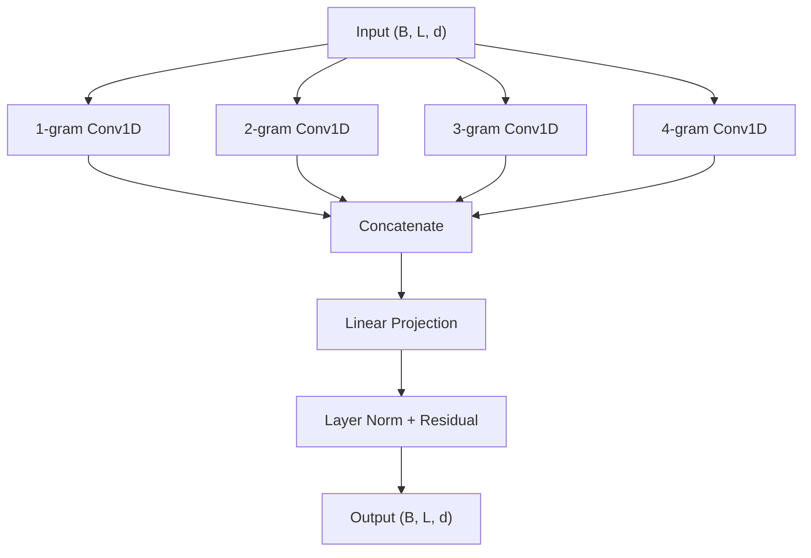

Captures local patterns in build orders:
- 1-gram: Individual entity importance
- 2-gram: Adjacent pairs (e.g., "Villager → Farm")
- 3-gram: Common sequences (e.g., "Villager, Villager, House")
- 4-gram: Extended patterns (e.g., "Barracks → Spearman × 3")

### 4. Mixture of Experts (MoE)

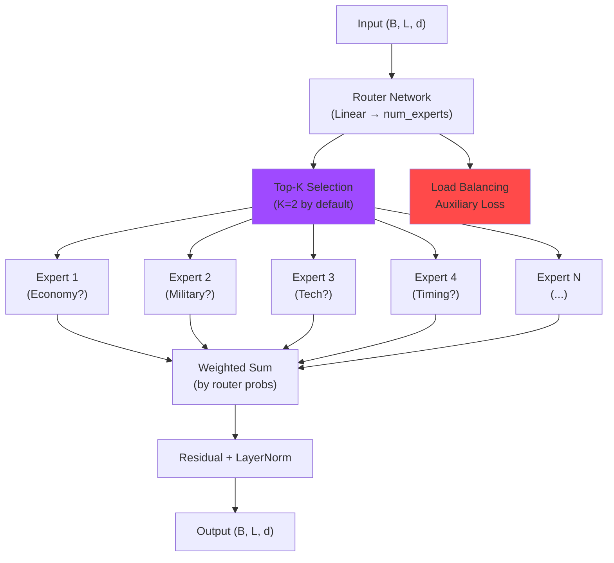

| Expert | Potential Specialization |
|--------|-------------------------|
| Expert 1 | Economy decisions (Villagers, resource buildings) |
| Expert 2 | Military units (Barracks, Archery Range, units) |
| Expert 3 | Technology/Upgrades |
| Expert 4 | Timing-based decisions |
| Expert 5 | Civilization-specific strategies |
| Expert 6 | Counter-play / Reactions |

The **load balancing loss** encourages even expert usage:
$$L_{aux} = \alpha \sum_{e=1}^{N} (p_e - \frac{1}{N})^2$$

### 5. Improved Transformer Block

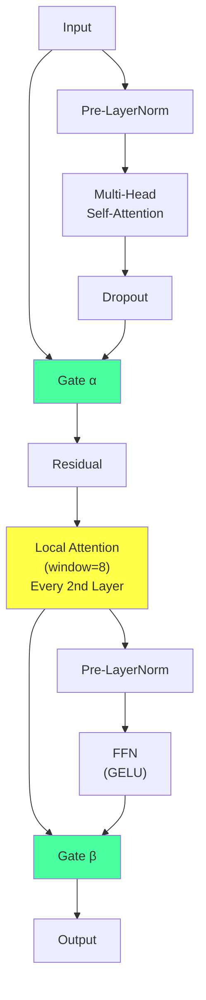

Key improvements:
- **Pre-norm architecture** for stable deep training
- **Gated residual connections** with learnable gates (α, β)
- **Alternating local/global attention** for multi-scale patterns

---

## Loss Functions

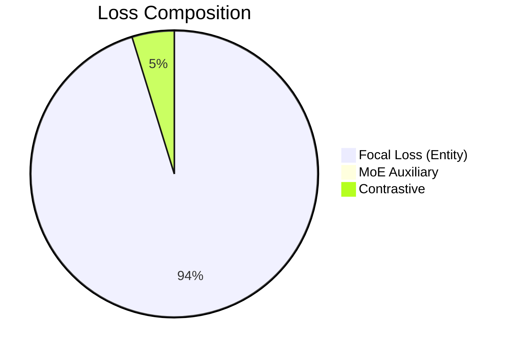

### Loss Details

| Loss | Weight | Formula | Description |
|------|--------|---------|-------------|
| **Focal Loss** | 1.0 | $FL(p_t) = -\alpha_t(1-p_t)^\gamma \log(p_t)$ | Addresses class imbalance, γ=2.0 |
| **MoE Aux** | 0.01 | $\sum_e (p_e - 1/N)^2$ | Load balancing across experts |
| **Contrastive** | 0.05 | InfoNCE | Same-civ sequences → similar embeddings |

### Focal Loss Visualization

```
                      ┌─────────────────────────────────────┐
                      │  Focal Loss: Focus on Hard Examples │
                      ├─────────────────────────────────────┤
 Loss Weight          │                                     │
       ▲              │  ●  Cross-Entropy                   │
       │              │  ○  Focal Loss (γ=2)                │
   1.0 ├──────●───────│─────────────────────────────────────│
       │       \      │                                     │
   0.8 ├────────●─────│                                     │
       │         \    │                                     │
   0.6 ├──────────●───│                                     │
       │           \  │                                     │
   0.4 ├────────────●─│                                     │
       │             \│      Well-classified examples       │
   0.2 ├──────────────●────●───●───●───────────────────────│
       │               \   │   │   │   (down-weighted)      │
   0.0 ├────────────────●──●───●───●───●───●───●──────────►│
       └──────────────────────────────────────────────────►
       0.0           0.25    0.5   0.75    1.0
                           p_t (Prediction Confidence)
```

---

## Data Pipeline

### SequenceDataset

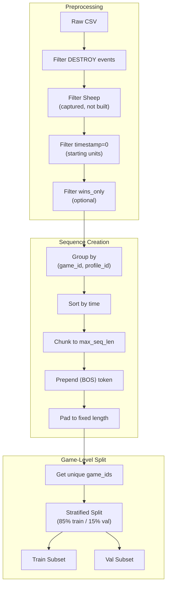

### Sequence Augmentation

| Augmentation | Probability | Description |
|-------------|-------------|-------------|
| **Adjacent Swap** | 5% | Swap two adjacent entities |
| **Drop** | 2% | Remove a random entity |
| **Repeat** | 2% | Duplicate an entity |

---

## Training Features

### Teacher Forcing Schedule


Default: **100% teacher forcing** for stable training with this enhanced architecture.

### Learning Rate Schedule

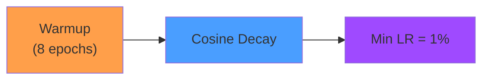

$$LR(t) = \begin{cases} 
\frac{t}{t_{warmup}} \cdot LR_{max} & t < t_{warmup} \\
LR_{max} \cdot \max(0.01, 0.5(1 + \cos(\pi \cdot \frac{t - t_{warmup}}{t_{total} - t_{warmup}}))) & t \geq t_{warmup}
\end{cases}$$

### Differential Learning Rates

| Component | Learning Rate |
|-----------|---------------|
| Embeddings | `lr × 0.3` |
| Attention & FFN | `lr × 1.0` |

---

## Civ-Entity Masking

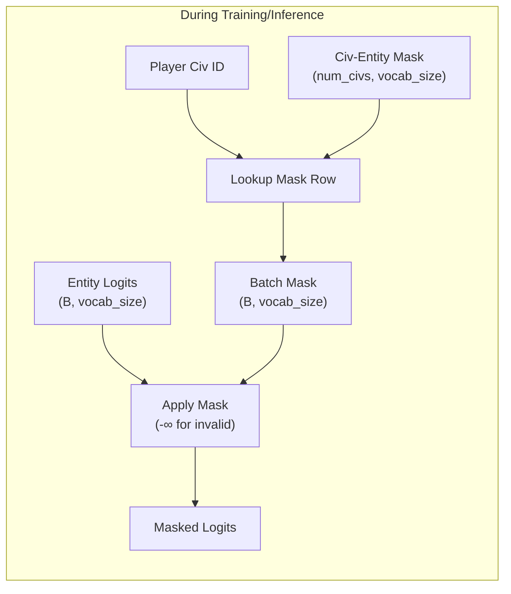

This ensures the model can only predict entities that the player's civilization can actually build.

---

## Entity Class Weights

Log-dampened inverse frequency weighting:

$$w_e = \frac{\log(N_{total} / N_e)}{\log(N_{total} / N_{median})}$$

```
┌────────────────────────────────────────────────────────────┐
│                Entity Class Weight Distribution             │
├────────────────────────────────────────────────────────────┤
│                                                             │
│ Villager        ███████████████████████████████ 0.35       │
│ Farm            ████████████████████████ 0.55              │
│ House           ███████████████████ 0.65                   │
│ Lumber Camp     ████████████████ 0.78                      │
│ ...                                                        │
│ Trebuchet       ████████████████████████████████████ 2.1   │
│ Wonder          ████████████████████████████████████ 2.5   │
│ Unique Unit     ████████████████████████████████████ 2.8   │
│                                                             │
│              Low Weight ◄──────────► High Weight           │
│              (Common)                (Rare)                 │
└────────────────────────────────────────────────────────────┘
```

Weights are capped at `[0.2, 5.0]` and normalized to mean = 1.0.

---

## Evaluation Metrics

| Metric | Description |
|--------|-------------|
| **Top-1 Accuracy** | Exact match of predicted entity |
| **Top-3 Accuracy** | Correct entity in top 3 predictions |
| **Top-5 Accuracy** | Correct entity in top 5 predictions |
| **Top-10 Accuracy** | Correct entity in top 10 predictions |
| **Mean Per-Class Acc** | Average accuracy across all entity types |
| **Loss** | Focal loss on validation set |

---

## Code Structure

| File | Key Components |
|------|----------------|
| [MoE_train.py](MoE_train.py) | Main training script |

### Classes

| Class | Purpose |
|-------|---------|
| `SequencePredictor` | Enhanced Transformer model with MoE, RoPE, N-gram |
| `SequencePredictorTrainer` | Training loop with contrastive + focal loss |
| `MixtureOfExperts` | Expert routing and weighted aggregation |
| `RotaryPositionalEmbedding` | RoPE implementation |
| `GatedCrossAttention` | Condition fusion with learnable gate |
| `NGramFeatureExtractor` | Multi-scale conv1D patterns |
| `ImprovedTransformerBlock` | Pre-norm + gated residuals |
| `LocalAttentionBlock` | Windowed attention (size=8) |
| `FocalLoss` | Class-imbalance aware loss |
| `ContrastiveLoss` | InfoNCE for representation learning |
| `SequenceAugmenter` | Data augmentation strategies |
| `SequenceDataset` | Game-level data loading |

### Utility Functions

| Function | Purpose |
|----------|---------|
| `build_vocabularies()` | Create entity/civ/map vocabs |
| `compute_entity_class_weights()` | Log-dampened frequency weights |
| `build_civ_entity_mapping()` | Map civs to valid entities |
| `create_civ_entity_mask()` | Boolean mask tensor |
| `create_data_loaders()` | Game-level train/val split |
| `log_example_predictions()` | WandB prediction logging |

---

## Default Hyperparameters

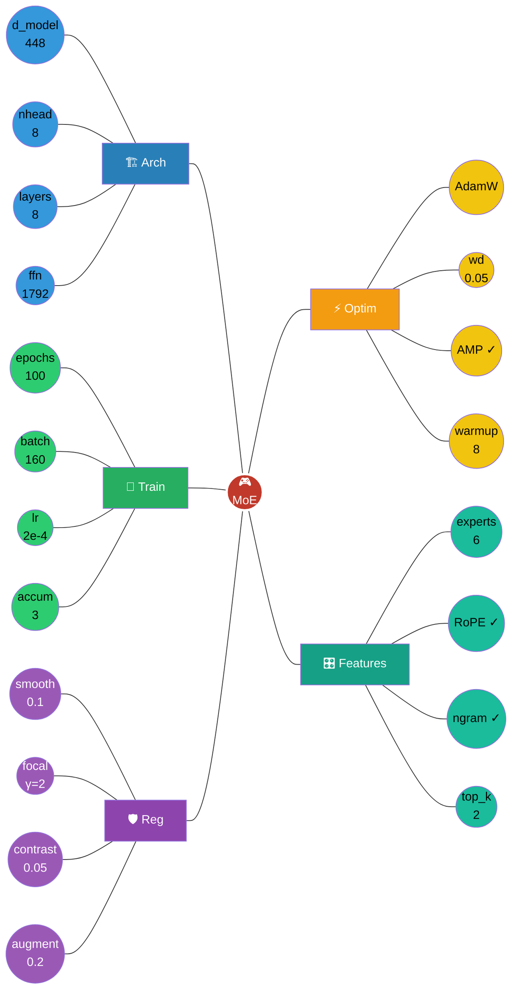

### Parameter Reference Tables

| Architecture | Value |
|--------------|-------|
| d_model | 448 |
| nhead | 8 |
| num_layers | 8 |
| dim_feedforward | 1792 (4× d_model) |
| max_seq_len | 128 |
| dropout | 0.15 |
| num_experts | 6 |

| Training | Value |
|----------|-------|
| batch_size | 160 |
| grad_accum_steps | 3 (effective: 480) |
| learning_rate | 2e-4 |
| epochs | 100 |
| warmup_epochs | 8 |
| val_split | 0.15 |
| weight_decay | 0.05 |

| Loss & Regularization | Value |
|----------------------|-------|
| label_smoothing | 0.1 |
| focal_loss_gamma | 2.0 |
| contrastive_weight | 0.05 |
| augment_prob | 0.2 |
| moe_aux_loss_coef | 0.01 |

---

## Feature Flags

| Flag | Default | Description |
|------|---------|-------------|
| `--use_moe` | True | Enable Mixture of Experts |
| `--use_ngram` | True | Enable N-gram feature extraction |
| `--use_rope` | True | Use Rotary Position Embeddings |
| `--use_contrastive` | True | Contrastive learning auxiliary loss |
| `--use_augmentation` | True | Sequence augmentation during training |
| `--wins_only` | False | Train only on winning games |

---

## Inference: Autoregressive Generation

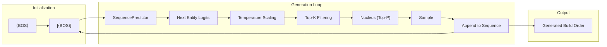

Sampling parameters:
- `temperature`: Controls randomness (1.0 = neutral)
- `top_k`: Keep only top-k most likely tokens
- `top_p`: Nucleus sampling threshold

---

## Usage

```bash
# Basic training
python BuildOrderPrediction/MoE_train.py

# Train on winning games only
python BuildOrderPrediction/MoE_train.py --wins_only

# Custom configuration
python BuildOrderPrediction/MoE_train.py \
    --epochs 150 \
    --batch_size 128 \
    --d_model 512 \
    --num_layers 10 \
    --num_experts 8 \
    --lr 1e-4

# Disable WandB logging
python BuildOrderPrediction/MoE_train.py --no_wandb
```

---

## Model Checkpointing

### Saved Checkpoint Contents

```python
checkpoint = {
    'model_state_dict': model.state_dict(),
    'entity_vocab': entity_vocab,
    'civ_vocab': civ_vocab,
    'map_vocab': map_vocab,
    'civ_entity_mapping': {k: list(v) for k, v in civ_entity_mapping.items()},
    'args': vars(args),
    'val_metrics': final_metrics,
    'best_val_loss': best_val_loss,
    'architecture': 'EnhancedSequencePredictor'
}
```

Files saved:
- `best_model.pth` - Best validation loss model
- `final_model.pth` - Final model with full metadata
