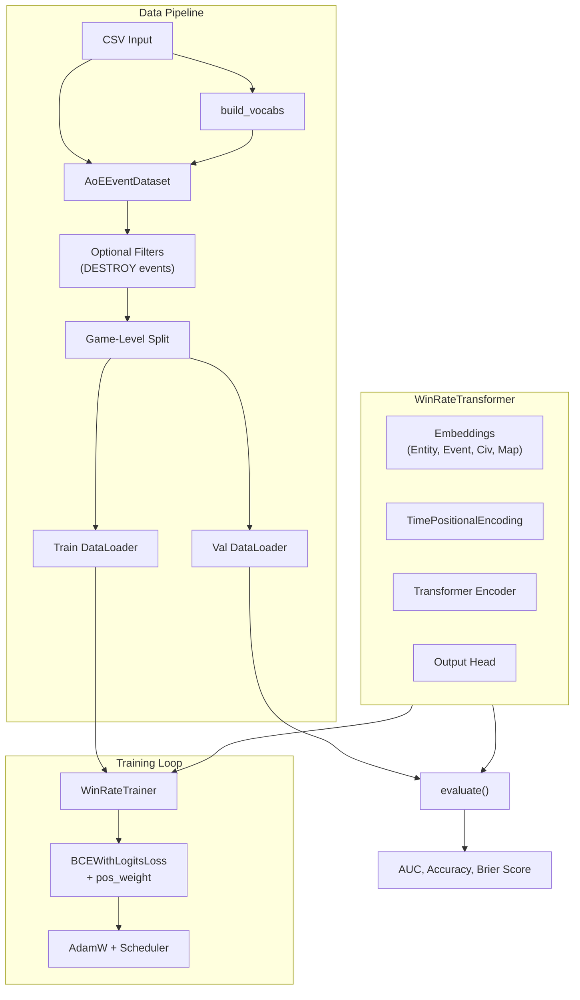
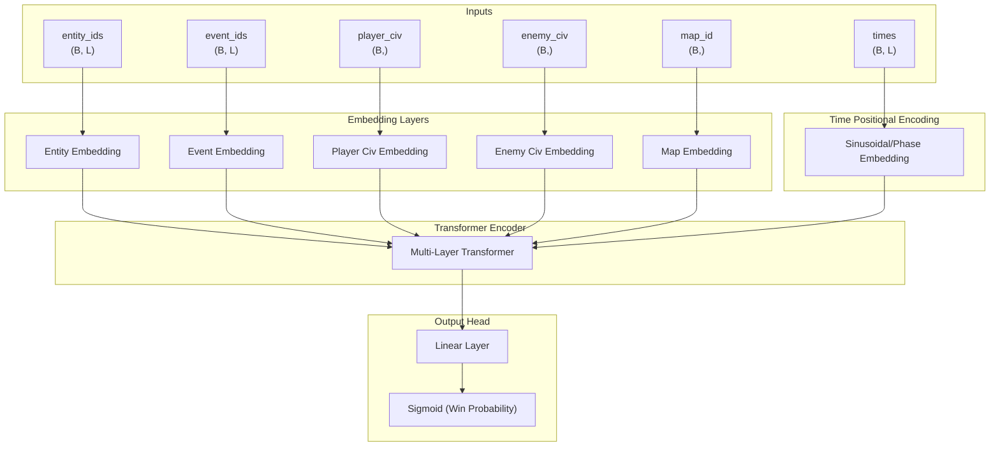

# Win Rate Prediction Transformer Architecture

---

## High-Level System Architecture



---

## Model Architecture: WinRateTransformer



---

## Key Components

### 1. Time Positional Encoding

- Sinusoidal encoding of time (seconds)
- Maps continuous time to phase embedding (Early/Mid/Late game)
- Enables model to learn temporal dynamics

### 2. Game-Level Data Split

- Train/val split by `game_id` (not random samples)
- Ensures player-vs-player integrity

### 3. Class Imbalance Handling

- Computes `pos_weight` for BCE loss:
  $$pos\_weight = \frac{N_{neg}}{N_{pos}}$$
- Addresses win/loss imbalance

### 4. Optional Event Filtering

- `DESTROY` events can be filtered out at training time
- Controlled via CLI flag: `--filter_destroy_events`

---

## Loss Function

- **Binary Cross-Entropy with Logits**
- Label smoothing applied: $y = y \times 0.9 + 0.05$
- Logits clamped to $[-8, 8]$ for numerical stability

---

## Evaluation Metrics

| Metric         | Description                       |
|---------------|-----------------------------------|
| **AUC**       | ROC-AUC for win/loss              |
| **Accuracy**  | Binary accuracy                   |
| **Brier Score** | Calibration of predicted probs   |
| **Balanced Accuracy** | Mean recall for win/loss    |
| **F1 Score**  | Harmonic mean of precision/recall |
| **ECE**       | Expected Calibration Error        |

---

## Training Features

- **Early Stopping**: Stops if no AUC improvement for 8 epochs
- **OneCycleLR Scheduler**: Dynamic learning rate schedule
- **AMP Support**: Optional mixed precision training
- **WandB Logging**: Metrics, histograms, model checkpoints

---

## Usage

```bash
# Basic training
python WinRatePrediction/WinRate_train.py --csv transformer_input.csv --epochs 20 --batch_size 64 --device cuda

# Filter DESTROY events
python WinRatePrediction/WinRate_train.py --filter_destroy_events --csv transformer_input.csv --epochs 20 --batch_size 64 --device cuda

# Custom configuration
python WinRatePrediction/WinRate_train.py \
    --epochs 50 \
    --batch_size 128 \
    --d_model 256 \
    --num_layers 4 \
    --lr 1e-4
```

---

## Model Checkpointing

### Saved Checkpoint Contents

```python
checkpoint = {
    'model_state': model.state_dict(),
    'vocabs': vocabs,
}
```

Files saved:
- `best_model.pt` - Best validation AUC model
- Custom output path via `--output best_model.pt`

---

## Code Structure

| File | Key Components |
|------|----------------|
| WinRate_train.py | Main training script |
| WinRateTransformerModel.py | Model architecture |
| aoe_player_game_datset.py | Dataset & vocab building |

### Classes

| Class | Purpose |
|-------|---------|
| `AoETransformer` | Transformer encoder for win prediction |
| `AoEEventDataset` | Game-level data loader |

### Utility Functions

| Function | Purpose |
|----------|---------|
| `build_vocabs()` | Create entity/event/civ/map vocabs |
| `evaluate()` | Validation metrics computation |
| `set_seed()` | Reproducible training |

---

## Default Hyperparameters

| Parameter | Value |
|-----------|-------|
| d_model | 128 |
| nhead | 4 |
| num_layers | 3 |
| dim_feedforward | 256 |
| dropout | 0.1 |
| batch_size | 64 |
| learning_rate | 5e-4 |
| epochs | 50 |
| val_split | 0.1 |
| max_pos_embed_cap | 1024 |

---

## Feature Flags

| Flag | Default | Description |
|------|---------|-------------|
| `--filter_destroy_events` | False | Filter DESTROY events |
| `--use_amp` | False | Use mixed precision |
| `--use_wandb` | True | Enable WandB logging |
| `--truncation_strategy` | head | Sequence truncation method |

---

## Summary

The WinRateTransformer model predicts game outcomes in AoE4 using event-based sequences, player/enemy civilizations, and map context. It leverages time-based positional encoding, game-level splits, and class imbalance handling for robust win/loss classification. Training is supported by early stopping, dynamic learning rates, and optional WandB logging for experiment tracking.
